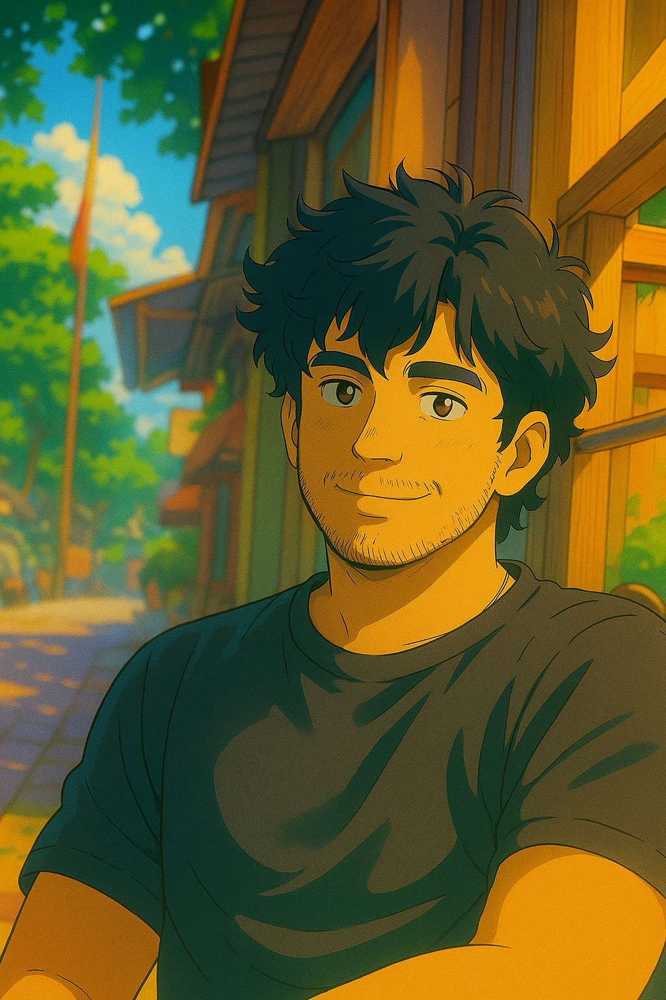

<!-- ═══════════════════════════════════════════════════════════════════ -->
<!--                    HEADER — CAPSULE WAVE                         -->
<!-- ═══════════════════════════════════════════════════════════════════ -->


<!-- ═══════════════════════════════════════════════════════════════════ -->
<!--                   TYPING ANIMATION                                -->
<!-- ═══════════════════════════════════════════════════════════════════ -->

<div align="center">

[](https://git.io/typing-svg)

</div>

<!-- ═══════════════════════════════════════════════════════════════════ -->
<!--             PROFILE PIC + INTRO (side by side)                   -->
<!-- ═══════════════════════════════════════════════════════════════════ -->

<br>

<table border="0" align="center">
<tr>
<td width="35%" align="center" valign="middle">

<!-- 
  ╔══════════════════════════════════════╗
  ║  IMPORTANT — One-time setup step:   ║
  ║  1. Create folder: assets/          ║
  ║  2. Drop your Ghibli pic in it as   ║
  ║     assets/profile.jpeg             ║
  ║  The  below will auto-render   ║
  ╚══════════════════════════════════════╝
-->



<br>


<br>

</td>
<td width="65%" valign="middle">

## Hi there, I'm **Harshaa** 🌿

> *"The best way to predict the future is to invent it."* — Alan Kay

🔬 **Foundational AI Researcher** @ IEEE OSPI '26 — working on NLP & Gen AI for the legal domain, mentored by leaders from **PayPal**, **Cisco** & former **IEEE Chair**. PoC presented at **Microsoft Office, Bangalore**.

📡 Former **Robotics Research Intern** @ cRAIS (IEEE–PES University) — published at **IEEE ICSET 2025, Kuala Lumpur** on DRL-based mobile robot navigation.

🛡️ **Cybersecurity Intern** @ CISFOR — diving deep into malware analysis (Mydoom), DDoS simulations & botnet architecture.

🎓 Pursuing **B.Tech CS** @ PES University + **B.Sc. Data Science** @ **IIT Madras** — simultaneously.

🌐 **Portfolio:** [kvharshaavardhana.uk](https://kvharshaavardhana.uk)
📄 **Resume:** [View Here](https://github.com/kvharsha/kvharsha/blob/main/assets/Harshaa_Vardhana_KV_Resume.pdf)

<br>


</td>
</tr>
</table>

---

<!-- ═══════════════════════════════════════════════════════════════════ -->
<!--               SNAKE CONTRIBUTION GRAPH                           -->
<!-- ═══════════════════════════════════════════════════════════════════ -->

<div align="center">

### 🐍 My Contributions Getting Devoured

<picture>
  <source media="(prefers-color-scheme: dark)" srcset="https://raw.githubusercontent.com/kvharsha/kvharsha/output/github-contribution-grid-snake-dark.svg" />
  <source media="(prefers-color-scheme: light)" srcset="https://raw.githubusercontent.com/kvharsha/kvharsha/output/github-contribution-grid-snake.svg" />
  
</picture>

</div>

---

<!-- ═══════════════════════════════════════════════════════════════════ -->
<!--          COMPETITIVE PROGRAMMING                                  -->
<!-- ═══════════════════════════════════════════════════════════════════ -->

<div align="center">

## ⚔️ Competitive Programming Arena


</div>

<br>

<table align="center" border="0">
<tr>
<td align="center" width="50%">

### 🟡 LeetCode

[](https://leetcode.com/u/kvharsha2002/)

[](https://leetcode.com/u/kvharsha2002/)

</td>
<td align="center" width="50%">

### 🔵 Codeforces

[](https://codeforces.com/profile/kvharsha2002)

[](https://codeforces.com/profile/kvharsha2002/)

> 📈 Track my real-time rank, rating history, and solved problems live on Codeforces!

</td>
</tr>
</table>

<br>

<div align="center">

### 📅 Daily Submission Tracker

[](https://leetcode.com/u/kvharsha2002/)
[](https://codeforces.com/profile/kvharsha2002)

</div>

---

<!-- ═══════════════════════════════════════════════════════════════════ -->
<!--                 OPEN SOURCE CONTRIBUTIONS                        -->
<!-- ═══════════════════════════════════════════════════════════════════ -->

<div align="center">

## 🌿 Open Source Footprint


</div>

<br>

<div align="center">

[](https://github.com/kvharsha)

<br>

<table border="0">
<tr>
<td>

[](https://github.com/kvharsha)

</td>
<td>

[](https://github.com/kvharsha)

</td>
</tr>
</table>

<br>

[](https://github.com/kvharsha)

</div>

---

<!-- ═══════════════════════════════════════════════════════════════════ -->
<!--                  TROPHIES                                        -->
<!-- ═══════════════════════════════════════════════════════════════════ -->
<!-- 
<div align="center">

## 🏆 GitHub Trophies

[](https://github.com/ryo-ma/github-profile-trophy) -->

</div>

---

<!-- ═══════════════════════════════════════════════════════════════════ -->
<!--                   RESEARCH PUBLICATIONS                          -->
<!-- ═══════════════════════════════════════════════════════════════════ -->

<div align="center">

## 🔬 Research & Publications


<br>

<!-- Animated badge row -->


<div align="center">

```text
╔═══════════════════════════════════════════════════════════════════╗
║   📡  IEEE ICSET 2025  ·  Kuala Lumpur, Malaysia  ·  Dec 2025    ║
╠═══════════════════════════════════════════════════════════════════╣
║                                                                   ║
║   DRL-based Navigation of Mobile Robot                           ║
║   in Unknown Environment                                         ║
║                                                                   ║
║   ▸ Framework  :  Double Deep Q-Network (DDQN)                   ║
║   ▸ Domain     :  Autonomous Robotics + Reinforcement Learning   ║
║   ▸ Core Idea  :  End-to-end policy for shortest-path            ║
║                   navigation in dynamic, unknown environments    ║
║   ▸ Outcome    :  Maximised cumulative reward, minimal steps     ║
║   ▸ Stack      :  Python  ·  PyTorch  ·  TensorFlow  ·  NumPy   ║
║                                                                   ║
║   [ 15th Intl. Conference on System Engineering & Technology ]   ║
╚═══════════════════════════════════════════════════════════════════╝
```

</div>

<div align="center">


<br>

<!-- Animated stat pills -->


<br>

[](https://git.io/typing-svg)

<br>

[](https://ieeexplore.ieee.org/document/11283908)
[](https://github.com/kvharsha/RL_Mobile_Navigation)

<br>

<!-- Research interests animated ticker -->
;Stochastic+Differential+Equations+%7C+Numerical+Methods;Deep+Reinforcement+Learning+%7C+DDQN+%7C+Policy+Gradient;Natural+Language+Processing+%7C+RAG+%7C+Legal+AI;Quantitative+Finance+%7C+Time-series+Modelling;Distributed+Systems+%7C+Kafka+%7C+Tile-based+Processing)

</div>

---

<!-- ═══════════════════════════════════════════════════════════════════ -->
<!--                    TECH STACK                                    -->
<!-- ═══════════════════════════════════════════════════════════════════ -->

<div align="center">

## 🛠️ Tech Stack I'm Currently Using


</div>

<br>

<div align="center">

### 🤖 AI / ML / Deep Learning
[](https://skillicons.dev)

`PyTorch` &nbsp; `TensorFlow` &nbsp; `Scikit-learn` &nbsp; `NumPy` &nbsp; `Pandas` &nbsp; `Matplotlib` &nbsp; `SciPy` &nbsp; `Plotly`

---

### 📱 Mobile & Cross-Platform
[](https://skillicons.dev)

`Flutter` &nbsp; `Dart` &nbsp; `Android Studio` &nbsp; `Swift` &nbsp; `Kotlin` &nbsp; `Objective-C` &nbsp; `Firebase`

---

### 🌐 Web Development
[](https://skillicons.dev)

`React` &nbsp; `Next.js` &nbsp; `TypeScript` &nbsp; `Express` &nbsp; `NestJS` &nbsp; `Tailwind CSS` &nbsp; `Framer Motion`

---

### 🗄️ Databases & Backend
[](https://skillicons.dev)

`MongoDB` &nbsp; `MySQL` &nbsp; `Redis` &nbsp; `Django` &nbsp; `DRF` &nbsp; `Apache Kafka` &nbsp; `SQLite`

---

### ⚙️ Systems, Robotics & Security
[](https://skillicons.dev)

`C / C++` &nbsp; `Rust` &nbsp; `Linux (Debian/REMnux)` &nbsp; `Arduino` &nbsp; `ROS` &nbsp; `Wireshark` &nbsp; `nmap` &nbsp; `MATLAB`

---

### ☁️ Cloud & DevOps
[](https://skillicons.dev)

`AWS EC2 / VPC` &nbsp; `Firebase` &nbsp; `CI/CD` &nbsp; `JWT` &nbsp; `ZeroTier`

</div>

---

<!-- ═══════════════════════════════════════════════════════════════════ -->
<!--               CURRENTLY WORKING ON                               -->
<!-- ═══════════════════════════════════════════════════════════════════ -->

<div align="center">

## 🚀 What I'm Building Right Now

</div>

```python
class HarshaaRightNow:
    def __init__(self):
        self.research       = "NLP & Gen AI for Legal Domain @ IEEE OSPI '26"
        self.poc_presented  = "Microsoft Office, Bangalore — to founders & VCs"
        self.mentors        = ["PayPal Senior Leader", "Cisco Director", "Former IEEE Chair"]
        self.dual_degree    = ["B.Tech CS — PES University", "B.Sc DS — IIT Madras"]
        self.coffee_count   = float("inf")  # non-negotiable

    def current_stack(self):
        return {
            "AI":      ["PyTorch", "RAG", "LLMs", "PINNs", "DRL"],
            "Web":     ["MERN", "Next.js", "TypeScript", "Redis"],
            "Systems": ["Apache Kafka", "Flask", "OpenCV"],
            "IoT":     ["Arduino", "Drones", "MPU6050"]
        }

    def fun_fact(self):
        return "I once built a drone that maps air pollution in 3D. No big deal. 🚁"
```

---

<!-- ═══════════════════════════════════════════════════════════════════ -->
<!--                 CONNECT WITH ME                                  -->
<!-- ═══════════════════════════════════════════════════════════════════ -->

<div align="center">

## 🌐 Find Me Across The Web


<br>

[](https://kvharshaavardhana.uk)
[](https://www.linkedin.com/in/harshaavardhanakv/)
[](https://github.com/kvharsha/)

<br>

[](https://leetcode.com/u/kvharsha2002/)
[](https://codeforces.com/profile/kvharsha2002/)
[](mailto:kvharshaavardhana@gmail.com)

</div>

---

<!-- ═══════════════════════════════════════════════════════════════════ -->
<!--                  BUY ME A COFFEE                                 -->
<!-- ═══════════════════════════════════════════════════════════════════ -->

<div align="center">

## ☕ Fuel the Research

> *"First, solve the problem. Then, write the code."* — John Johnson

If my work sparked an idea, helped your project, or you just vibe with what I'm building — a coffee goes a long way into keeping the commits alive at 2 AM. 🌙

[](https://www.buymeacoffee.com/Harshaa_codes)

</div>

---

<!-- ═══════════════════════════════════════════════════════════════════ -->
<!--                    RESUME SECTION                                -->
<!-- ═══════════════════════════════════════════════════════════════════ -->

<div align="center">

## 📄 Resume

Want the full picture? My resume has everything — research, internships, projects, and certifications.

[](https://github.com/kvharsha/kvharsha/blob/main/assets/Harshaa_Vardhana_KV_Resume.pdf)

> **Setup tip:** Upload your resume PDF to `assets/Harshaa_Vardhana_KV_Resume.pdf` in this repo and the button above will work automatically.

</div>

---

<!-- ═══════════════════════════════════════════════════════════════════ -->
<!--                   QUOTE TICKER                                   -->
<!-- ═══════════════════════════════════════════════════════════════════ -->

<div align="center">


</div>

---

<!-- ═══════════════════════════════════════════════════════════════════ -->
<!--                     FOOTER WAVE                                  -->
<!-- ═══════════════════════════════════════════════════════════════════ -->

<div align="center">

*"The people who are crazy enough to think they can change the world are the ones who do."* — Steve Jobs

**Made with 🌿 + ☕ + lots of StackOverflow by Harshaa Vardhana KV**

</div>


